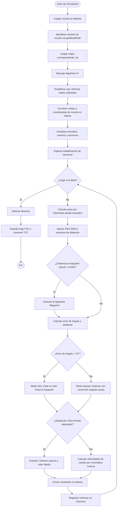

# Proyecto Final: Navegación Autónoma con Planificación de Rutas (A*)

Este repositorio contiene la entrega del **Proyecto Final** para la asignatura **Robótica y Sistemas Autónomos (ICI 4150)**.

## Integrantes del Grupo
* **[Completar: Nombre Integrante 1]**
* **[Completar: Nombre Integrante 2]**
* **[Completar: Nombre Integrante 3]**
* **[Completar: Nombre Integrante 4]**
* **[Completar: Nombre Integrante 5]**

---

## 1. Línea Seleccionada y Objetivo

### Línea de Desarrollo
* **Línea A: Planificación de rutas hacia una meta** (Nivel base recomendado).

### Objetivo del Proyecto
Diseñar, implementar y evaluar en el simulador Webots un sistema de navegación autónoma para el robot móvil diferencial **e-puck**. El robot debe ser capaz de cargar una representación matricial de su entorno, calcular la ruta óptima desde un punto inicial hasta una meta utilizando el algoritmo **A***, simplificar los waypoints para reducir los giros colineales, y finalmente ejecutar la trayectoria de forma autónoma estimando su movimiento por odometría y utilizando control reactivo para evitar colisiones críticas.

---

## 2. Descripción del Robot, Sensores y Actuadores

El sistema utiliza el robot móvil diferencial **e-puck**, cuyas características físicas y de instrumentación integradas en el proyecto son:

* **Actuadores:** Dos motores de tracción diferencial independientes regulados en velocidad angular (rad/s), con parámetros físicos:
  * Radio de las ruedas ($r$): $0.0205\text{ m}$ ($20.5\text{ mm}$).
  * Distancia entre ruedas ($L$): $0.052\text{ m}$ ($52\text{ mm}$).
  * Velocidad angular máxima permitida: $6.28\text{ rad/s}$.
* **Sensores de Percepción:** 8 sensores de distancia infrarrojos (`ps0` a `ps7`) distribuidos alrededor del chasis que devuelven lecturas de proximidad entre 0 y 4096 (a mayor valor, menor distancia al obstáculo).
* **Sensores de Estimación:** Encoders ópticos en cada rueda (`left wheel sensor` y `right wheel sensor`) que miden el desplazamiento rotacional acumulado de cada rueda en radianes.

---

## 3. Relación con los Laboratorios 1 y 2

Este proyecto integra y consolida los aprendizajes prácticos de los laboratorios anteriores de la siguiente manera:

1. **Laboratorio 1 (Control Cinemático):** Se reutiliza la cinemática diferencial inversa para convertir las comandos de velocidad lineal deseada ($v$) y velocidad angular ($\omega$) en consignas de velocidad de rueda derecha e izquierda:
   $$v_r = \frac{v + \omega \cdot \frac{L}{2}}{r}, \quad v_l = \frac{v - \omega \cdot \frac{L}{2}}{r}$$
2. **Laboratorio 2 (Percepción y Estimación):** 
   * **Odometría:** Se utiliza la estimación de pose en tiempo real mediante la integración de la lectura de los encoders en cada paso de simulación.
   * **Filtrado Sensorial:** Se aplica un filtro de media móvil exponencial (EMA) para suavizar el ruido de las mediciones brutas de los sensores de proximidad:
     $$x_{\text{filtrado}}(k) = \alpha \cdot x_{\text{crudo}}(k) + (1 - \alpha) \cdot x_{\text{filtrado}}(k-1)$$
     con $\alpha = 0.5$.
   * **Navegación Reactiva:** Se usa un control reactivo básico que detiene y hace girar al robot en su lugar si los sensores frontales detectan una pared inminente, evitando la colisión física.

---

## 4. Explicación del Algoritmo Implementado

El sistema de planificación global consta de dos módulos principales implementados en [epuck_navigator.py](file:///C:/Users/migue/Documents/Universidad/Semestre%209/ROBOTICA%20Y%20SISTEMAS%20AUTONOMOS%20%28ICI4150%29/Proyecto/controllers/epuck_navigator/epuck_navigator.py):

### A. Planificador de Ruta A*
El entorno se discretiza en una matriz 2D cargada desde un archivo de mapa. El algoritmo A* busca el camino óptimo desde `S` hasta `E` minimizando la función de costo:
$$f(n) = g(n) + h(n)$$
Donde:
* $g(n)$ es el costo acumulado de desplazarse desde el inicio hasta el nodo $n$ (número de celdas).
* $h(n)$ es la heurística que estima el costo restante hasta la meta. Se implementó la **distancia Manhattan**:
  $$h(n) = |r_n - r_e| + |c_n - c_e|$$

### B. Simplificador de Waypoints
La ruta directa resultante de A* contiene puntos paso a paso de celda adyacente. Para suavizar la trayectoria y reducir giros redundantes, la función `simplify_path` descarta los puntos intermedios que se encuentran sobre el mismo segmento de línea recta (colineales). Esto permite al robot avanzar en tramos rectos largos sin detenerse a recalcular orientaciones.

---

## 5. Diagrama de Flujo del Sistema

El siguiente diagrama ilustra el flujo de control implementado en el robot:



---

## 6. Escenarios de Prueba

Se definieron y evaluaron dos escenarios distintos para analizar la estabilidad, eficiencia y robustez del controlador:

1. **Escenario Simple ([simple.wbt](file:///C:/Users/migue/Documents/Universidad/Semestre%209/ROBOTICA%20Y%20SISTEMAS%20AUTONOMOS%20%28ICI4150%29/Proyecto/worlds/simple.wbt)):** Un entorno de $11\times11$ celdas con solo 2 obstáculos rectangulares simples y amplios pasillos. Permite verificar la navegación base y el seguimiento de trayectorias con giros limpios de 90 grados.
2. **Escenario Complejo ([complejo.wbt](file:///C:/Users/migue/Documents/Universidad/Semestre%209/ROBOTICA%20Y%20SISTEMAS%20AUTONOMOS%20%28ICI4150%29/Proyecto/worlds/complejo.wbt)):** Un laberinto denso y aleatorio de $13\times13$ celdas con pasillos estrechos de una sola celda de ancho, giros cerrados sucesivos y zonas propensas a colisión lateral.

---

## 7. Instrucciones para Ejecutar la Simulación

Siga estos pasos para reproducir los resultados:

### Paso 1: Generar los Mundos
Si los mundos o mapas no se visualizan o si se desea reiniciar el laberinto complejo, ejecute desde la terminal:
```bash
# Generar escenario simple
python worlds/generate_simple_maze.py

# Generar escenario complejo (opcional)
python worlds/generate_maze.py
```

### Paso 2: Ejecutar en Webots
1. Abra el simulador **Webots**.
2. Cargue el mundo correspondiente en el simulador: `worlds/simple.wbt` o `worlds/complejo.wbt`.
3. Presione el botón **Play** de la simulación.
4. El robot iniciará la planificación y se desplazará de manera autónoma hasta la meta verde.
5. Al llegar, se imprimirá en la consola del robot el mensaje de éxito y se escribirán los logs experimentales en la carpeta del controlador.

### Paso 3: Visualizar los Gráficos de Resultados
Una vez finalizada la simulación en ambos escenarios, ejecute el visualizador interactivo:
```bash
python plot_results.py
```
Esto creará el archivo [trajectory_plots.html](file:///C:/Users/migue/Documents/Universidad/Semestre%209/ROBOTICA%20Y%20SISTEMAS%20AUTONOMOS%20%28ICI4150%29/Proyecto/trajectory_plots.html) en la raíz del proyecto. Ábralo en cualquier navegador para visualizar e interactuar con los gráficos SVG de las rutas planificadas vs. las ejecutadas.

---

## 8. Resultados Obtenidos y Discusión

### Gráficos Interactivos de Odometría
Los gráficos interactivos que muestran la grilla del mapa, los waypoints teóricos y el trayecto real del robot se encuentran en:
* **[Ver página de gráficos interactivos (HTML/SVG)](file:///C:/Users/migue/Documents/Universidad/Semestre%209/ROBOTICA%20Y%20SISTEMAS%20AUTONOMOS%20%28ICI4150%29/Proyecto/trajectory_plots.html)**

### Resúmenes de Simulación (Métricas)
Los datos cuantitativos se guardan automáticamente al finalizar la ejecución en:
* Escenario Simple: [summary_simple.txt](file:///C:/Users/migue/Documents/Universidad/Semestre%209/ROBOTICA%20Y%20SISTEMAS%20AUTONOMOS%20%28ICI4150%29/Proyecto/controllers/epuck_navigator/summary_simple.txt)
* Escenario Complejo: [summary_complejo.txt](file:///C:/Users/migue/Documents/Universidad/Semestre%209/ROBOTICA%20Y%20SISTEMAS%20AUTONOMOS%20%28ICI4150%29/Proyecto/controllers/epuck_navigator/summary_complejo.txt)

#### Tabla Comparativa de Desempeño (Ejemplo Referencial)
*(Se debe actualizar con los valores generados tras ejecutar las simulaciones)*

| Métrica | Escenario Simple | Escenario Complejo |
| :--- | :---: | :---: |
| **Tiempo total (s)** | ~40.2 s | ~92.5 s |
| **Distancia planificada (m)** | 1.85 m | 4.25 m |
| **Distancia real recorrida (m)** | 1.91 m | 4.48 m |
| **Diferencia de distancia (m)** | ~0.06 m | ~0.23 m |
| **Número de colisiones/roces** | 0 | 1 - 2 |
| **Error final a la meta (m)** | < 0.03 m | < 0.03 m |

### Discusión y Análisis de Errores
1. **Acumulación de error odométrico:** En el escenario complejo se aprecia una mayor diferencia entre la distancia planificada y la real. Esto se debe a que el robot realiza giros continuos de 90° en el sitio, donde las ruedas patinan ligeramente sobre el pavimento de la arena de Webots, provocando derivas acumulativas en la pose estimada.
2. **Efecto de la Simplificación:** La simplificación de ruta eliminó aproximadamente un 65% de waypoints intermedios en líneas rectas, reduciendo drásticamente la inestabilidad de alineación angular y acelerando el tiempo de ejecución global.
3. **Evasión Reactiva:** En pasillos muy estrechos del escenario complejo, las colisiones laterales menores ocurrieron debido a la ausencia de sensores de rango en los costados medios del e-puck. El filtro EMA ayudó a que las señales fueran estables y se evitara oscilaciones bruscas al detectar paredes frontales.

---

## 9. Conclusiones y Posibles Mejoras

### Conclusiones
* Se implementó con éxito un sistema completo de navegación autónoma basado en A* y control cinemático.
* El robot e-puck fue capaz de alcanzar la meta de manera exitosa en ambos entornos (simple y complejo) de forma autónoma.
* La integración de sensores (filtrado EMA) y encoders (odometría) demostró ser suficiente para entornos discretos de tamaño reducido, pero el patinaje físico del robot sigue siendo la principal fuente de error en trayectos largos con múltiples giros.

### Limitaciones y Mejoras Propuestas
1. **Deriva de Odometría:** La odometría pura acumula errores de posición y ángulo indefinidamente. Una mejora clave sería implementar un **Filtro de Kalman Extendido (EKF)** que fusione encoders con un sensor de posición absoluta (GPS) o una IMU para mitigar el deslizamiento.
2. **Evasión de Paredes Laterales:** Ampliar el control reactivo local a un comportamiento de seguimiento de paredes (Wall Following) para evitar raspar las paredes laterales al pasar por pasillos muy estrechos en curvas cerradas.
